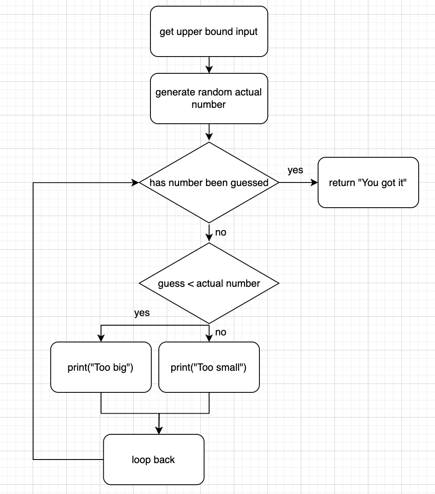

This week was very straightforward with the exercises. Here's the flowchart for exercise 2:

### Coding experience

It was interesting reading the other code for making a pyramid. I think that it's really interesting how different the solutions can be to achieve the same result and the advantages of different solutions. Many solutions are much more readable than others and I think it's important to write solutions like those. Also, the solutions with good whitespace were so much more readable than those which were very condensed.